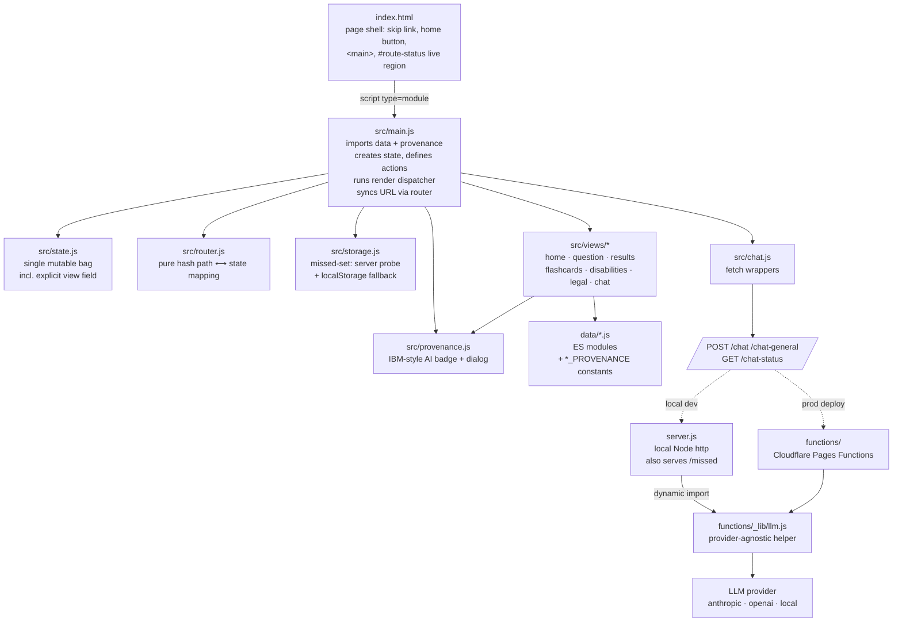
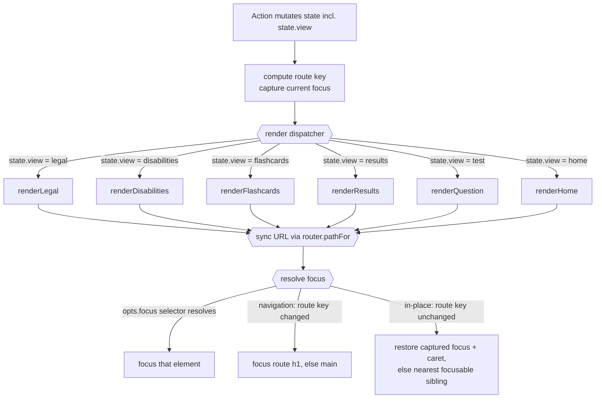
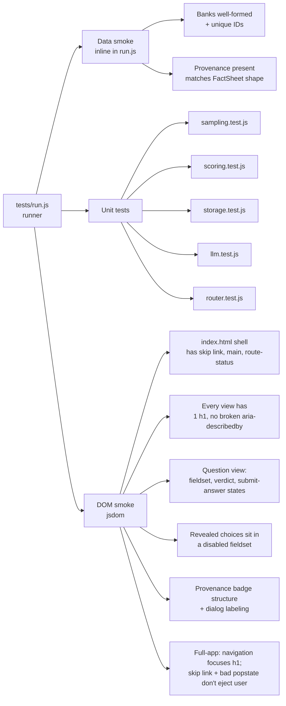

# Architecture

A one-sitting tour of how the app fits together. Aimed at contributors who want to add a feature, fix a bug, or just understand the codebase before opening a PR.

## Design constraints

1. **Zero runtime dependencies.** The browser loads native ES modules; the local server is plain `node:http`. Cloudflare Pages Functions use the Workers runtime — also no `npm install` needed.
2. **No build step.** What you commit is what runs.
3. **WCAG 2.2 AA, audited.** Every UI change goes through the accessibility-lead review before merging (see `CONTRIBUTING.md`).
4. **AI provenance is visible.** No content is shown without an inline provenance badge (or, for live chat, a permanent banner). See `AI_TRANSPARENCY.md`.

These constraints are what keep the project readable for new contributors. Please respect them, or open an issue arguing for a change before sending a PR that breaks them.

## High-level architecture



**Plain-text description (read this if the diagram doesn't render or you're using a screen reader):**

- `index.html` is the page shell — skip link, home button, a `<main>` element, and a persistent `#route-status` live region that sits outside `<main>` so `innerHTML` rewrites can't destroy it.
- It loads `src/main.js` as a native ES module. `main.js` is the orchestrator: it imports the data files and their provenance constants, creates the shared mutable state object, defines all action callbacks, runs the render dispatcher, and syncs the URL hash (via `src/router.js`) after every render.
- `src/state.js` exports a factory for the single mutable state bag, including the explicit `view` field the dispatcher reads.
- `src/router.js` is a pure module (no DOM, no history API) mapping between a hash path like `#/test/3` and the state fields needed to restore it. Used by `main.js` for URL sync and popstate handling.
- `src/storage.js` handles missed-question persistence. It probes the server's `/missed` endpoint once at boot; if that fails (e.g. on Cloudflare Pages, which doesn't host that endpoint), it falls back to per-browser `localStorage` for the rest of the session.
- `src/provenance.js` renders the IBM-style AI transparency badge and the page-level "About AI in this app" dialog.
- `src/views/*` are the per-screen render functions (home, question, results, flashcards, disabilities, legal, and the chat fragment shared by question + results). They read from state, render HTML strings, and wire event handlers.
- `data/*.js` exports the question banks, flashcards, and reference datasets plus a `*_PROVENANCE` constant per file.
- `src/chat.js` exposes thin fetch wrappers for the chat endpoints.
- The chat endpoints (`POST /chat`, `POST /chat-general`, `GET /chat-status`) are served either by `server.js` (local Node http, which also handles `/missed`) or by `functions/` (Cloudflare Pages Functions). Both go through the same `functions/_lib/llm.js` helper, which forwards the request to whichever LLM provider is configured by env var: `anthropic`, `openai`, or `local` (any OpenAI-compatible server you run yourself). `server.js` is CommonJS and the helper is an ES module, so it loads it with a cached dynamic `import()` rather than duplicating the call.

## The render loop



**Plain-text description:** every state mutation calls `render()` again. There is no virtual DOM, no reactive framework — every render replaces the entire `<main>` contents. There is a router (`src/router.js`), used only for URL sync, not for dispatch. The dispatcher itself switches on the explicit `state.view` field (`'home' | 'test' | 'results' | 'flashcards' | 'disabilities' | 'legal'`), set by whichever action last changed the screen — it is not inferred from data presence. That distinction is load-bearing: inferring the screen from data (e.g. "home = empty `state.questions`") would force "go back to home" to destroy the in-progress test, which would make Forward unable to resume it. With an explicit view, Back to home leaves `state.questions` (and `answers`, `pending`, `revealed`) intact in memory, and Forward restores the `test` view with everything still in place.

`render(opts = {})` also owns focus. Before the DOM is replaced it computes a **route key** — `[state.view, state.index, state.disabilities?.category, state.legal?.category]` — and compares it against the key from the previous render to decide whether this is a real navigation or an in-place re-render (chat send, card flip, a toggle). It also captures whatever is currently focused (`captureFocus()`), in case the in-place path is taken. After rendering and syncing the URL, focus resolves in priority order: an explicit `opts.focus` CSS selector, if it resolves, wins outright; otherwise a route-key change (or `opts.focus === 'route'`) moves focus to the destination's own `<h1>` (or `<main>` if the view has none); otherwise the captured focus and caret position are restored (`restoreFocus()`), falling back to the nearest focusable sibling if the originally-focused control was disabled by this same render (e.g. Prev at flashcard 1). See `ACCESSIBILITY.md`'s "Focus contract" section for the accessibility rationale, including why the focus target must always be visible.

`announce(msg, { assertive })`, also in `main.js`, writes to `#route-status` — a persistent `role="status"` region that is a sibling of `<main>` in `index.html`, so `app.innerHTML` rewrites can't destroy it. It carries the submit verdict, chat replies/errors, and the "that page isn't available" popstate fallback message. A pending message is cleared, then re-set on a 75ms `setTimeout` (not `requestAnimationFrame`) so that announcing the same string twice in a row still fires — `aria-live` only speaks on a text *change*, and rAF runs the clear and the set within the same paint, which can coalesce them into one no-op mutation. See the comment above `announce()` in `src/main.js` for the full reasoning.

The pattern in code:

```js
function render(opts = {}) {
  // wire the home button (lives outside <main>)
  const newRouteKey = routeKey(state);
  const isNavigation = newRouteKey !== lastRouteKey;
  lastRouteKey = newRouteKey;
  const preserved = captureFocus();

  switch (state.view) {
    case 'legal':        renderLegal(ctx); break;
    case 'disabilities': renderDisabilities(ctx); break;
    case 'flashcards':   renderFlashcards(ctx); break;
    case 'results':      renderResults(ctx); break;
    case 'test':         renderQuestion(ctx); break;
    case 'home':
    default:             renderHome(ctx); break;
  }
  document.title = titleFor(state);
  // sync URL hash to state.view (see "Browser Back/Forward" below)

  if (opts.focus && opts.focus !== 'route') {
    const el = document.querySelector(opts.focus);
    if (el) { el.focus(); return; }
  }
  if (isNavigation || opts.focus === 'route') moveFocusToRoute();
  else restoreFocus(preserved);
}
```

## State

A single mutable object created in `src/state.js`. Views never own state; they receive it via `ctx.state` and never mutate it directly — they invoke `ctx.actions.*` callbacks defined in `main.js` that mutate state and call `render()`.

```js
{
  view:           // "home" | "test" | "results" | "flashcards" | "disabilities" | "legal"
  mode:           // "weighted" | "missed" | "bear"
  questions:      // sampled questions for the current test
  answers:        // qid → "A"|"B"|"C"|"D" (committed)
  pending:        // qid → choice (selected but not submitted)
  revealed:       // qid → true once user has seen the answer
  index:          // current question index
  submitted:      // true once test is finalized
  chats:          // per-question chats { qid → {open, history} }
  homeChat:       // home-page chat { history: [...] }
  chatEnabled:    // null until /chat-status resolves at boot, then true | false
  flashcards:     // { cards, index, flipped } when active
  disabilities:   // { view, category } when active
  legal:          // { view, category } when active
}
```

## Views

Each view is a function `renderX(ctx)` that:

1. Builds an HTML string for the entire screen
2. Writes it into `ctx.app.innerHTML` (the `<main>` element)
3. Wires event listeners on the new DOM nodes

There is no diffing — every render replaces the entire `<main>` contents. This is fast enough for the scale (1 question = ~5 KB of HTML) and keeps the code obvious.

Focus preservation across a re-render is mostly automatic: `render()` itself captures whatever is focused before swapping `innerHTML` and restores it afterward (see "The render loop" above), so most views don't need to think about it. A view only says more when the automatic behavior isn't what's wanted — an explicit `render({ focus: '#selector' })` (the flashcard flip control, the results per-question chat toggle) — or for a control that had no focus before the click, such as the verdict region after Submit answer, which still uses `requestAnimationFrame(() => el.focus())` after the render.

## Browser Back/Forward

`src/router.js` maps between a URL hash path and the state fields needed to restore that screen. It is pure — no DOM, no `history`/`location` reads — so it's unit-tested directly in `tests/router.test.js` without a browser.

Route table:

```
#/                          home
#/test/<n>                  question view, n = 1-based question number
#/results                   results
#/flashcards                flashcards
#/disabilities              category grid
#/disabilities/<categoryId> category detail list
#/legal                     jurisdiction grid
#/legal/<categoryId>        jurisdiction detail list
```

Two functions:

- `pathFor(state)` — the hash path for the current state.
- `applyPath(path, state, ids)` — mutates state to match `path`. Returns `true` if restorable, `false` if not. `ids` (`{disabilityCategoryIds, legalCategoryIds}`) is used only to detect an unknown category/jurisdiction id; passed separately because `state` doesn't own the static reference data.

**Scope decisions, deliberate:**

- Question index IS in the path — stepping between questions in a sampled, in-memory test is a genuine navigation axis, and Back/Forward between questions preserves answers because of the `state.view` refactor (see "The render loop" above).
- Flashcard index is NOT in the path. Advancing a card is a study action on a freshly-shuffled deck, not navigation — putting 60 cards in history would make Back useless for actually leaving the deck.
- `flipped` state, chat open/closed, and answer selections are NOT in the path.

**Cold-load / unrestorable fallback.** `#/test/3` and `#/results` cannot be reconstructed from a URL alone: the question set is sampled at runtime and the answers live only in memory. On a fresh page load (or a Back into a stale entry after a reload), `applyPath` returns `false` for these and the caller falls back to home via `history.replaceState` — never `pushState` — so the URL never lies about what's on screen. The same applies to `#/disabilities/<id>` / `#/legal/<id>` with an unknown id (falls back to the category/jurisdiction grid) and `#/test/<n>` with `n` out of range (clamps to the nearest valid question instead of failing outright). `#/results` additionally requires `state.submitted` **and** a non-empty `state.questions`, not `submitted` alone — "Back to start" clears the question set but used to leave `submitted` true, so a stale `#/results` history entry could restore a page reporting a phantom `0 / 0 (0%)` score.

**Wiring, in `src/main.js`:**

- After every render, `pathFor(state)` is compared against `location.hash`. Only pushes a new entry if they differ — this is what keeps chat sends, card flips, and radio clicks (re-renders that don't change `state.view`/index/category) from spamming the history stack.
- A `popstate` listener first checks that the new hash is `''` or starts with `#/` — anything else (notably the skip link's native `href="#app"` jump) is ignored outright rather than handed to `applyPath`, which would otherwise treat it as an unknown route and bounce the user to home mid-task. For a hash that does look like a route, it calls `applyPath(location.hash, state, routeIds)`, falls back via `replaceState` (with an `announce()` naming the actual fallback destination) if unrestorable, then re-renders. A module-level flag (`renderingFromPopstate`) tells `render()` this pass came from Back/Forward, so it skips the push; focus is then handled by `render()`'s ordinary navigation-vs-in-place logic (see "The render loop" above and `ACCESSIBILITY.md`'s focus contract), not by a special case here.
- The skip link itself intercepts its own click (`preventDefault` + a direct focus move to the route's landmark) rather than letting the browser follow `href="#app"` — that native jump is exactly the kind of non-route hash the popstate guard above exists for; intercepting it is belt-and-suspenders. The `href` stays for no-JS fallback.
- On startup, `location.hash` is parsed once and resolved with `history.replaceState` — never `pushState`, since this establishes the current entry rather than creating a new one.
- `document.title` is set per view (`titleFor(state)`) on every render, so Back/Forward is distinguishable in browser history and announced by screen readers.

## Accessibility patterns

The accessibility contracts live in `src/views/*` and `styles/app.css`. Some highlights:

- **Skip link → `<main tabindex="-1">`** so keyboard users skip past the home button. It intercepts its own click rather than letting the browser follow `href="#app"` natively (see "Browser Back/Forward" above for why).
- **Focus contract.** `render(opts)` moves focus to the destination route's own `<h1>` on a real navigation (including Back/Forward), and preserves the previously-focused control's focus and caret position on an in-place re-render (chat send, card flip, a toggle). See "The render loop" above for the mechanics and `ACCESSIBILITY.md` for the accessibility rationale, including why the focus target must always be visible.
- **Answer choices** are native `<input type="radio">` elements inside a `<fieldset>`/`<legend>` — standard browser radio-group keyboard behavior (Tab into the group, Arrow keys move within it), no custom tabindex management. A visible hint above the group explains the arrow-key behavior; it adapts via `@media (pointer: coarse)` to drop the keyboard sentence on touch devices. Once an answer is revealed, the fieldset gets the native `disabled` attribute, so review state is genuinely non-interactive — not the previous `aria-disabled`, which claimed to be disabled but wasn't. The per-choice "your answer" / "correct answer" state that `disabled` removes from the accessibility tree is restored as visually-hidden text on the label.
- **Verdict and other transient announcements** go through `announce()` (see "The render loop" above), which writes to the persistent `#route-status` region rather than a per-view live region — `#verdict` no longer carries `aria-live` itself, since a region can't announce content set in the same `innerHTML` write that creates it. `#verdict` still receives explicit focus on submit via `requestAnimationFrame`, so sighted keyboard users land on the visible result text too.
- **`prefers-reduced-motion`** is honored in `scrollIntoViewMotionSafe()` (used by the results jump grid and reference anchor bars) and, since this pass, in CSS: `styles/app.css` neutralises transitions and the category-card hover transform under `@media (prefers-reduced-motion: reduce)`.
- **Decorative emoji** are wrapped in `<span aria-hidden="true">` everywhere.
- **AI provenance badges** use native `<details>/<summary>` for zero-JS disclosure; the `<summary>`'s accessible name comes from its own visible content, not an overriding `aria-label` (WCAG 2.5.3), with a disambiguating item label appended via `.sr-only`. Confidence pills use a paired color + shape glyph + text to satisfy WCAG 1.4.1 (Use of Color).
- **Colour is never the sole channel** elsewhere either: chat speaker identity has a visible "You:"/"Tutor:"/"Error:" label, the question jump grid's answered state has a `✓`/`·` glyph, and the current-question cell has a visible inset ring — all fixed for WCAG 1.4.1 after a full contrast audit found some relied on hue deltas as low as 1.02:1. See `ACCESSIBILITY.md` for the full audit result.

## Provenance

Every dataset exports a `*_PROVENANCE` constant alongside the data. `src/provenance.js` exports:

- `renderProvenanceBadge(prov, itemLabel)` — inline badge with collapsible card
- `renderChatProvenanceBanner()` — static banner above chat transcripts
- `renderAiInfoDialog()` + `installAiInfoDialog()` — the page-level "About AI in this app" modal

See `AI_TRANSPARENCY.md` for the full rationale and per-bucket details.

## Chat request lifecycle

```mermaid
sequenceDiagram
  accTitle: Per-question chat tutor request flow
  accDescr: User submits a chat message. The browser POSTs to /chat with the question text, choices, correct answer, BoK rationale, and chat history. The endpoint (local Node or Cloudflare Function) builds a system prompt grounding the model in the question context and hands it to the shared helper functions/_lib/llm.js. The helper sends it to the configured LLM provider — Anthropic, OpenAI, or a local model server — in that provider's wire format, then normalises whatever comes back to a single shape: reply, provider, and model. The browser appends the reply to the chat log. Errors return an error field with a real status code and fall back to a visible error message in the transcript.

  participant U as User
  participant B as Browser (src/chat.js)
  participant E as Endpoint<br/>(server.js or functions/chat.js)
  participant L as _lib/llm.js
  participant A as LLM provider<br/>(anthropic · openai · local)
  U->>B: Type and submit message
  B->>B: Push to chat history, re-render
  B->>E: POST /chat<br/>{question, choices, answer, why, cite, history, userMessage}
  E->>E: Build system prompt with question context
  E->>L: chatResponse({system, messages})
  L->>A: POST /v1/messages or /chat/completions<br/>(per provider wire format)
  A-->>L: provider-specific envelope
  L->>L: Extract reply, strip &lt;think&gt; scratchpad
  L-->>E: { reply, provider, model }
  E-->>B: 200 OK<br/>{ reply, provider, model }
  B->>B: Append assistant message, re-render
  B-->>U: Reply visible in chat log<br/>(with "AI live response" banner)
```

**Plain-text description:** when the user sends a chat message,

1. The browser pushes the message into the chat history and re-renders (showing the user's message immediately).
2. It POSTs to `/chat` with the question text, choices, correct letter, the user's submitted answer (if any), per-choice rationale, the BoK citation, the prior chat history, and the new message.
3. The endpoint (local `server.js` or `functions/chat.js`) builds a system prompt that grounds the model in the question context, then hands it to `functions/_lib/llm.js`.
4. The helper sends the request to the configured provider in that provider's wire format (`/v1/messages` for `anthropic`; `/chat/completions` for `openai` and `local`) and normalises the response to `{ reply, provider, model }`. Any `<think>…</think>` scratchpad from a local reasoning model is stripped.
5. The browser appends the assistant reply to the history and re-renders.

If any step fails, the endpoint returns `{ error }` with a real status code (503 when no provider is configured, 502 when the endpoint is unreachable or the reply is empty, the upstream status on an upstream error) and the error is shown as a red message in the transcript. The chat log itself is a `role="log" aria-live="polite"` region so screen readers announce new messages politely.

## Server / Functions

Two parallel server implementations cover the two deploy modes:

| Endpoint | Local (`server.js`) | Cloudflare (`functions/`) |
|---|---|---|
| `GET /chat-status` | inline handler | `functions/chat-status.js` |
| `POST /chat` | inline handler | `functions/chat.js` |
| `POST /chat-general` | inline handler | `functions/chat-general.js` |
| `GET/PUT/DELETE /missed` | inline handler with `data.json` | **not deployed** |

Both sides call the *same* provider implementation: `functions/_lib/llm.js`. The Functions import it directly. `server.js` is CommonJS and the helper is an ES module, so it loads it with a cached dynamic `import()`. There is no duplicated vendor call any more.

### Provider selection

`resolveConfig(env)` in `functions/_lib/llm.js` picks the backend:

| Env var | Meaning |
|---|---|
| `LLM_PROVIDER` | `anthropic` \| `openai` \| `local`. If unset, auto-detected: `LLM_BASE_URL` set → `local`, else `ANTHROPIC_API_KEY` → `anthropic`, else `OPENAI_API_KEY` → `openai` |
| `LLM_API_KEY` | Credential. Required for `anthropic` and `openai`, not for `local`. Falls back to `ANTHROPIC_API_KEY` / `OPENAI_API_KEY` |
| `LLM_MODEL` | Model id. Falls back to `ANTHROPIC_MODEL` / `OPENAI_MODEL`, then a per-provider default |
| `LLM_BASE_URL` | Endpoint override. Any OpenAI-compatible server |
| `LLM_MAX_TOKENS` | Answer-budget override. Non-numeric or `<= 0` falls back to the per-provider default |

Defaults: `anthropic` → `https://api.anthropic.com` + `claude-sonnet-4-6` + 1024 tokens; `openai` → `https://api.openai.com/v1` + `gpt-4o-mini` + 1024 tokens; `local` → `http://127.0.0.1:1234/v1` + `qwen/qwen3.6-35b-a3b` + 3000 tokens. `local` gets the larger budget because reasoning-capable models spend most of it on hidden thinking before emitting any visible text (~1,300 reasoning tokens for a simple question against the default model), and a cloud-sized 1024 truncates them into an empty reply. Timeouts are 120s for `local` (cold model load) and 60s for cloud providers.

`local` is the OpenAI wire format pointed at a server you run yourself (LM Studio, Ollama, llama.cpp, vLLM), with the key optional. It works under `node server.js` or a local `wrangler pages dev` **only** — deployed Pages Functions run on Cloudflare's edge network and cannot reach `localhost`, a LAN address, or a Tailscale `100.x` address.

## Tests

```bash
node tests/run.js   # or: npm test
```

The runner discovers every `tests/*.test.js` and calls its exported `run({ test, assertTrue, assertEq })`. Test layers:

| Layer | Files |
|---|---|
| Data smoke tests (inline in `run.js`) | every dataset is well-formed, IDs unique, provenance present |
| Unit tests | `sampling.test.js`, `scoring.test.js`, `storage.test.js`, `llm.test.js`, `router.test.js` |
| DOM smoke tests (jsdom) | `views.test.js` — asserts every view's accessibility contracts, plus a full-app popstate-focus test |

113+ tests as of writing; every PR should keep this green.



**Plain-text description:** the runner has three layers:

- **Data smoke tests** (inline in `tests/run.js`): every data file loads, every question has the required fields, IDs are unique across the CPACC and Bear banks, and every dataset exports a `*_PROVENANCE` constant in the IBM FactSheet shape.
- **Unit tests**:
  - `sampling.test.js` covers `shuffle`, `sampleQuestions`, `sampleMissedQuestions` with a deterministic injected RNG.
  - `scoring.test.js` covers `scoreTest` (perfect/zero/partial/domain breakdown) and `domainLabel`.
  - `storage.test.js` covers the missed-set store with mocked `fetch` and an in-memory `localStorage` polyfill.
  - `llm.test.js` covers `resolveConfig` (provider auto-detection, env-var fallbacks, per-provider defaults, missing-credential errors), the per-provider request shape, reply extraction, and `<think>` stripping.
  - `router.test.js` covers `pathFor`/`applyPath`: every route round-trips, unrestorable paths (cold-load `#/test/n` or `#/results`, no deck for `#/flashcards`, or `#/results` with `submitted` true but no questions left) return `false`, unknown category/jurisdiction ids fall back to the grid, out-of-range question numbers clamp, and malformed/empty hashes resolve to home.
- **DOM smoke tests** (`views.test.js`, using jsdom): assert the accessibility contracts of every view — index.html shell has the skip link, focusable main, and a `#route-status` live region as a sibling of `#app`; every view has exactly one h1; the question view's fieldset, verdict region, submit-answer button states, and aria-describedby targets all resolve; revealed choices sit inside a `disabled` fieldset with per-choice state restored as visually-hidden text; the provenance badge has the expected structure (visible-content-named summary, dual-encoded confidence pill, semantic `<dl>` card); the AI-info dialog is properly labelled; a full-app boot test asserts that clicking through a test pushes `#/test/<n>` entries and that both click- and popstate-driven navigation move focus to the destination's `<h1>`; and dedicated regression tests assert the skip link and a non-route `popstate` hash (like `#app`) don't reset the app to home.

## Things that look weird and aren't

- **`window.X = ...` in index.html?** Gone. The Phase 2 refactor switched to ES modules. If you find old code referencing `window.CPACC_BANK`, it's a regression — file a bug.
- **No package.json scripts beyond `test` and `start`?** Intentional. No bundler, no linter, no formatter — the goal is readability over tooling.
- **Two server implementations?** Yes — one for local Node dev, one for Cloudflare Functions. They behave identically for the chat endpoints because both call the same `functions/_lib/llm.js`. The local one *also* supports cross-device missed-sync via `data.json`.
- **A CommonJS file `import()`ing an ES module?** Deliberate. `server.js` must stay dependency-free CommonJS, but the provider helper is shared with the ESM Pages Functions. A cached dynamic `import()` is the cheapest way to have one implementation instead of two.
- **`<details>` instead of a custom disclosure widget?** Per accessibility-lead recommendation — native semantics + zero JS + works on mobile + has implicit `aria-expanded`. The default disclosure triangle is suppressed via CSS so we can render our own chevron.

## Where to add things

| New feature | Likely files to touch |
|---|---|
| New question | `data/questions.js` (or `data/bear-questions.js`) — append item, ID must be unique across both banks |
| New view | `src/views/new.js` + add a dispatcher branch in `main.js` |
| New chat endpoint | `functions/foo.js` + add a handler in `server.js` for local parity |
| New a11y contract | a `tests/views.test.js` assertion |
| New provenance category | edit `src/provenance.js` (`CONFIDENCE` map, `renderProvenanceBadge`) |
