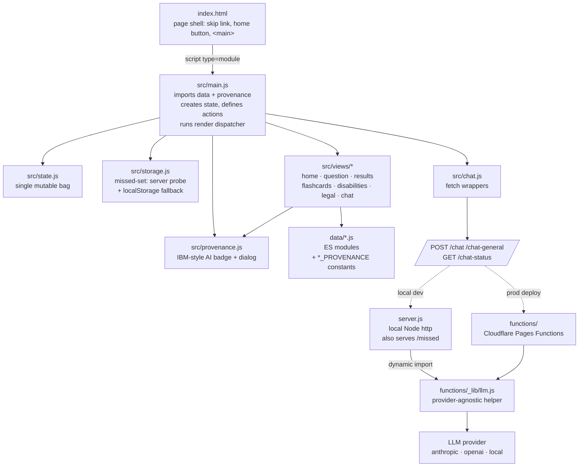
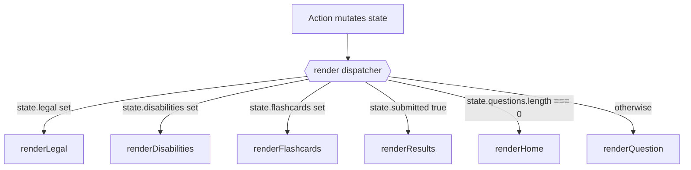
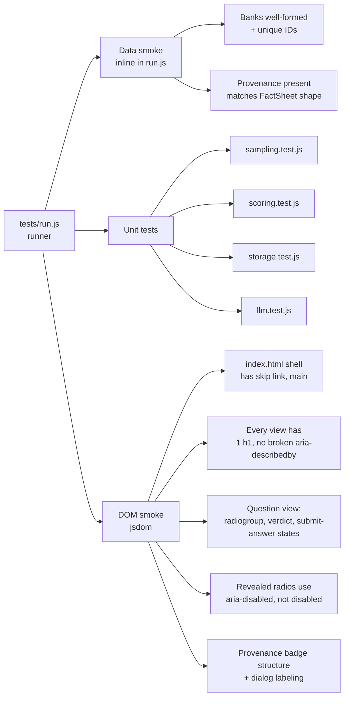

# Architecture

A one-sitting tour of how the app fits together. Aimed at contributors who want to add a feature, fix a bug, or just understand the codebase before opening a PR.

## Design constraints

1. **Zero runtime dependencies.** The browser loads native ES modules; the local server is plain `node:http`. Cloudflare Pages Functions use the Workers runtime — also no `npm install` needed.
2. **No build step.** What you commit is what runs.
3. **WCAG 2.2 AA, audited.** Every UI change goes through the accessibility-lead review before merging (see `CONTRIBUTING.md`).
4. **AI provenance is visible.** No content is shown without an inline provenance badge (or, for live chat, a permanent banner). See `AI_TRANSPARENCY.md`.

These constraints are what keep the project readable for new contributors. Please respect them, or open an issue arguing for a change before sending a PR that breaks them.

## High-level architecture



**Plain-text description (read this if the diagram doesn't render or you're using a screen reader):**

- `index.html` is the page shell — skip link, home button, and a `<main>` element.
- It loads `src/main.js` as a native ES module. `main.js` is the orchestrator: it imports the data files and their provenance constants, creates the shared mutable state object, defines all action callbacks, and runs the render dispatcher.
- `src/state.js` exports a factory for the single mutable state bag.
- `src/storage.js` handles missed-question persistence. It probes the server's `/missed` endpoint once at boot; if that fails (e.g. on Cloudflare Pages, which doesn't host that endpoint), it falls back to per-browser `localStorage` for the rest of the session.
- `src/provenance.js` renders the IBM-style AI transparency badge and the page-level "About AI in this app" dialog.
- `src/views/*` are the per-screen render functions (home, question, results, flashcards, disabilities, legal, and the chat fragment shared by question + results). They read from state, render HTML strings, and wire event handlers.
- `data/*.js` exports the question banks, flashcards, and reference datasets plus a `*_PROVENANCE` constant per file.
- `src/chat.js` exposes thin fetch wrappers for the chat endpoints.
- The chat endpoints (`POST /chat`, `POST /chat-general`, `GET /chat-status`) are served either by `server.js` (local Node http, which also handles `/missed`) or by `functions/` (Cloudflare Pages Functions). Both go through the same `functions/_lib/llm.js` helper, which forwards the request to whichever LLM provider is configured by env var: `anthropic`, `openai`, or `local` (any OpenAI-compatible server you run yourself). `server.js` is CommonJS and the helper is an ES module, so it loads it with a cached dynamic `import()` rather than duplicating the call.

## The render loop



**Plain-text description:** every state mutation calls `render()` again. The dispatcher checks state fields in this priority order and returns at the first match:

1. `state.legal` → `renderLegal`
2. `state.disabilities` → `renderDisabilities`
3. `state.flashcards` → `renderFlashcards`
4. `state.submitted === true` → `renderResults`
5. `state.questions.length === 0` → `renderHome`
6. otherwise → `renderQuestion`

There is no router, no virtual DOM, no reactive framework. The pattern in code:

```js
function render() {
  // wire the home button (lives outside <main>)
  if (state.legal)          return renderLegal(ctx);
  if (state.disabilities)   return renderDisabilities(ctx);
  if (state.flashcards)     return renderFlashcards(ctx);
  if (state.submitted)      return renderResults(ctx);
  if (state.questions.length === 0) return renderHome(ctx);
  return renderQuestion(ctx);
}
```

## State

A single mutable object created in `src/state.js`. Views never own state; they receive it via `ctx.state` and never mutate it directly — they invoke `ctx.actions.*` callbacks defined in `main.js` that mutate state and call `render()`.

```js
{
  mode:           // "weighted" | "missed" | "bear"
  questions:      // sampled questions for the current test
  answers:        // qid → "A"|"B"|"C"|"D" (committed)
  pending:        // qid → choice (selected but not submitted)
  revealed:       // qid → true once user has seen the answer
  index:          // current question index
  submitted:      // true once test is finalized
  chats:          // per-question chats { qid → {open, history} }
  homeChat:       // home-page chat { history: [...] }
  chatEnabled:    // true if /chat-status reported enabled
  flashcards:     // { cards, index, flipped } when active
  disabilities:   // { view, category } when active
  legal:          // { view, category } when active
}
```

## Views

Each view is a function `renderX(ctx)` that:

1. Builds an HTML string for the entire screen
2. Writes it into `ctx.app.innerHTML` (the `<main>` element)
3. Wires event listeners on the new DOM nodes

There is no diffing — every render replaces the entire `<main>` contents. This is fast enough for the scale (1 question = ~5 KB of HTML) and keeps the code obvious.

When a re-render would lose focus on something the user is interacting with (e.g. the verdict region after Submit answer), the view explicitly captures and restores focus with `requestAnimationFrame(() => el.focus())`.

## Accessibility patterns

The accessibility contracts live in `src/views/*` and `styles/app.css`. Some highlights:

- **Skip link → `<main tabindex="-1">`** so keyboard users skip past the home button.
- **Radio groups** use the WAI-ARIA roving-tabindex pattern (Tab enters, Arrow keys move within). A visible hint above the group explains the pattern for users who don't know it. The hint adapts via `@media (pointer: coarse)` to drop the keyboard sentence on touch devices.
- **Verdict announcement** uses a single `<div id="verdict" tabindex="-1" aria-live="polite">` that receives focus on submit. Only one polite live region per view (a11y-lead caught a "dueling live regions" bug in the original monolith).
- **Revealed radios** use `aria-disabled="true"` not native `disabled` — keyboard users can still navigate to review their choices.
- **`prefers-reduced-motion`** is honored in `scrollIntoViewMotionSafe()` (used by the results jump grid and reference anchor bars).
- **Decorative emoji** are wrapped in `<span aria-hidden="true">` everywhere.
- **AI provenance badges** use native `<details>/<summary>` for zero-JS disclosure. Confidence pills use a paired color + shape glyph + text to satisfy WCAG 1.4.1 (Use of Color).

## Provenance

Every dataset exports a `*_PROVENANCE` constant alongside the data. `src/provenance.js` exports:

- `renderProvenanceBadge(prov, itemLabel)` — inline badge with collapsible card
- `renderChatProvenanceBanner()` — static banner above chat transcripts
- `renderAiInfoDialog()` + `installAiInfoDialog()` — the page-level "About AI in this app" modal

See `AI_TRANSPARENCY.md` for the full rationale and per-bucket details.

## Chat request lifecycle

```mermaid
sequenceDiagram
  accTitle: Per-question chat tutor request flow
  accDescr: User submits a chat message. The browser POSTs to /chat with the question text, choices, correct answer, BoK rationale, and chat history. The endpoint (local Node or Cloudflare Function) builds a system prompt grounding the model in the question context and hands it to the shared helper functions/_lib/llm.js. The helper sends it to the configured LLM provider — Anthropic, OpenAI, or a local model server — in that provider's wire format, then normalises whatever comes back to a single shape: reply, provider, and model. The browser appends the reply to the chat log. Errors return an error field with a real status code and fall back to a visible error message in the transcript.

  participant U as User
  participant B as Browser (src/chat.js)
  participant E as Endpoint<br/>(server.js or functions/chat.js)
  participant L as _lib/llm.js
  participant A as LLM provider<br/>(anthropic · openai · local)
  U->>B: Type and submit message
  B->>B: Push to chat history, re-render
  B->>E: POST /chat<br/>{question, choices, answer, why, cite, history, userMessage}
  E->>E: Build system prompt with question context
  E->>L: chatResponse({system, messages})
  L->>A: POST /v1/messages or /chat/completions<br/>(per provider wire format)
  A-->>L: provider-specific envelope
  L->>L: Extract reply, strip &lt;think&gt; scratchpad
  L-->>E: { reply, provider, model }
  E-->>B: 200 OK<br/>{ reply, provider, model }
  B->>B: Append assistant message, re-render
  B-->>U: Reply visible in chat log<br/>(with "AI live response" banner)
```

**Plain-text description:** when the user sends a chat message,

1. The browser pushes the message into the chat history and re-renders (showing the user's message immediately).
2. It POSTs to `/chat` with the question text, choices, correct letter, the user's submitted answer (if any), per-choice rationale, the BoK citation, the prior chat history, and the new message.
3. The endpoint (local `server.js` or `functions/chat.js`) builds a system prompt that grounds the model in the question context, then hands it to `functions/_lib/llm.js`.
4. The helper sends the request to the configured provider in that provider's wire format (`/v1/messages` for `anthropic`; `/chat/completions` for `openai` and `local`) and normalises the response to `{ reply, provider, model }`. Any `<think>…</think>` scratchpad from a local reasoning model is stripped.
5. The browser appends the assistant reply to the history and re-renders.

If any step fails, the endpoint returns `{ error }` with a real status code (503 when no provider is configured, 502 when the endpoint is unreachable or the reply is empty, the upstream status on an upstream error) and the error is shown as a red message in the transcript. The chat log itself is a `role="log" aria-live="polite"` region so screen readers announce new messages politely.

## Server / Functions

Two parallel server implementations cover the two deploy modes:

| Endpoint | Local (`server.js`) | Cloudflare (`functions/`) |
|---|---|---|
| `GET /chat-status` | inline handler | `functions/chat-status.js` |
| `POST /chat` | inline handler | `functions/chat.js` |
| `POST /chat-general` | inline handler | `functions/chat-general.js` |
| `GET/PUT/DELETE /missed` | inline handler with `data.json` | **not deployed** |

Both sides call the *same* provider implementation: `functions/_lib/llm.js`. The Functions import it directly. `server.js` is CommonJS and the helper is an ES module, so it loads it with a cached dynamic `import()`. There is no duplicated vendor call any more.

### Provider selection

`resolveConfig(env)` in `functions/_lib/llm.js` picks the backend:

| Env var | Meaning |
|---|---|
| `LLM_PROVIDER` | `anthropic` \| `openai` \| `local`. If unset, auto-detected: `LLM_BASE_URL` set → `local`, else `ANTHROPIC_API_KEY` → `anthropic`, else `OPENAI_API_KEY` → `openai` |
| `LLM_API_KEY` | Credential. Required for `anthropic` and `openai`, not for `local`. Falls back to `ANTHROPIC_API_KEY` / `OPENAI_API_KEY` |
| `LLM_MODEL` | Model id. Falls back to `ANTHROPIC_MODEL` / `OPENAI_MODEL`, then a per-provider default |
| `LLM_BASE_URL` | Endpoint override. Any OpenAI-compatible server |
| `LLM_MAX_TOKENS` | Answer-budget override. Non-numeric or `<= 0` falls back to the per-provider default |

Defaults: `anthropic` → `https://api.anthropic.com` + `claude-sonnet-4-6` + 1024 tokens; `openai` → `https://api.openai.com/v1` + `gpt-4o-mini` + 1024 tokens; `local` → `http://127.0.0.1:1234/v1` + `qwen/qwen3.6-35b-a3b` + 3000 tokens. `local` gets the larger budget because reasoning-capable models spend most of it on hidden thinking before emitting any visible text (~1,300 reasoning tokens for a simple question against the default model), and a cloud-sized 1024 truncates them into an empty reply. Timeouts are 120s for `local` (cold model load) and 60s for cloud providers.

`local` is the OpenAI wire format pointed at a server you run yourself (LM Studio, Ollama, llama.cpp, vLLM), with the key optional. It works under `node server.js` or a local `wrangler pages dev` **only** — deployed Pages Functions run on Cloudflare's edge network and cannot reach `localhost`, a LAN address, or a Tailscale `100.x` address.

## Tests

```bash
node tests/run.js   # or: npm test
```

The runner discovers every `tests/*.test.js` and calls its exported `run({ test, assertTrue, assertEq })`. Test layers:

| Layer | Files |
|---|---|
| Data smoke tests (inline in `run.js`) | every dataset is well-formed, IDs unique, provenance present |
| Unit tests | `sampling.test.js`, `scoring.test.js`, `storage.test.js`, `llm.test.js` |
| DOM smoke tests (jsdom) | `views.test.js` — asserts every view's accessibility contracts |

72+ tests as of writing; every PR should keep this green.



**Plain-text description:** the runner has three layers:

- **Data smoke tests** (inline in `tests/run.js`): every data file loads, every question has the required fields, IDs are unique across the CPACC and Bear banks, and every dataset exports a `*_PROVENANCE` constant in the IBM FactSheet shape.
- **Unit tests**:
  - `sampling.test.js` covers `shuffle`, `sampleQuestions`, `sampleMissedQuestions` with a deterministic injected RNG.
  - `scoring.test.js` covers `scoreTest` (perfect/zero/partial/domain breakdown) and `domainLabel`.
  - `storage.test.js` covers the missed-set store with mocked `fetch` and an in-memory `localStorage` polyfill.
  - `llm.test.js` covers `resolveConfig` (provider auto-detection, env-var fallbacks, per-provider defaults, missing-credential errors), the per-provider request shape, reply extraction, and `<think>` stripping.
- **DOM smoke tests** (`views.test.js`, using jsdom): assert the accessibility contracts of every view — index.html shell has the skip link and focusable main; every view has exactly one h1; the question view's radiogroup, verdict region, submit-answer button states, and aria-describedby targets all resolve; revealed radios use `aria-disabled` not native `disabled`; the provenance badge has the expected structure (labeled summary, dual-encoded confidence pill, semantic `<dl>` card); and the AI-info dialog is properly labelled.

## Things that look weird and aren't

- **`window.X = ...` in index.html?** Gone. The Phase 2 refactor switched to ES modules. If you find old code referencing `window.CPACC_BANK`, it's a regression — file a bug.
- **No package.json scripts beyond `test` and `start`?** Intentional. No bundler, no linter, no formatter — the goal is readability over tooling.
- **Two server implementations?** Yes — one for local Node dev, one for Cloudflare Functions. They behave identically for the chat endpoints because both call the same `functions/_lib/llm.js`. The local one *also* supports cross-device missed-sync via `data.json`.
- **A CommonJS file `import()`ing an ES module?** Deliberate. `server.js` must stay dependency-free CommonJS, but the provider helper is shared with the ESM Pages Functions. A cached dynamic `import()` is the cheapest way to have one implementation instead of two.
- **`<details>` instead of a custom disclosure widget?** Per accessibility-lead recommendation — native semantics + zero JS + works on mobile + has implicit `aria-expanded`. The default disclosure triangle is suppressed via CSS so we can render our own chevron.

## Where to add things

| New feature | Likely files to touch |
|---|---|
| New question | `data/questions.js` (or `data/bear-questions.js`) — append item, ID must be unique across both banks |
| New view | `src/views/new.js` + add a dispatcher branch in `main.js` |
| New chat endpoint | `functions/foo.js` + add a handler in `server.js` for local parity |
| New a11y contract | a `tests/views.test.js` assertion |
| New provenance category | edit `src/provenance.js` (`CONFIDENCE` map, `renderProvenanceBadge`) |
